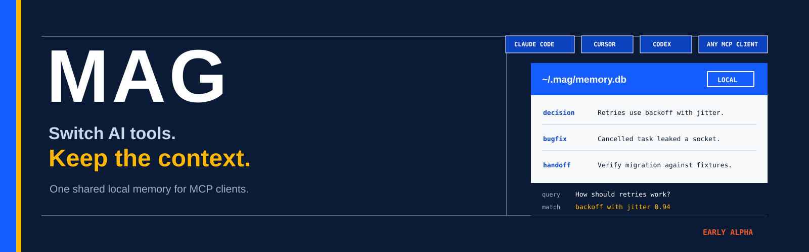
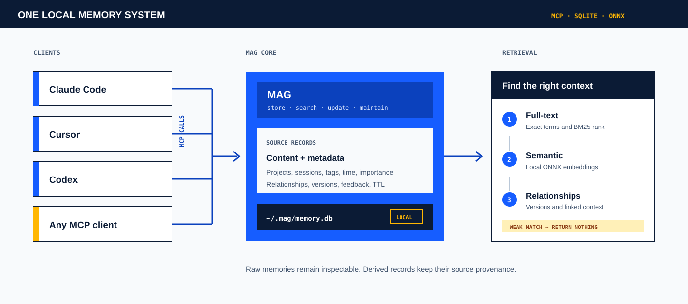
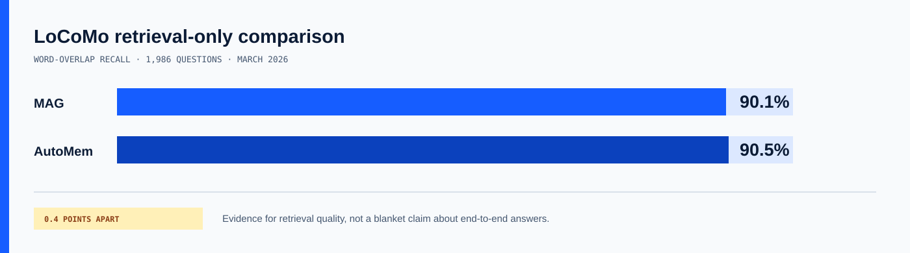

<picture>
  
</picture>

<p align="center">
  <a href="https://george-rd.github.io/mag/"><strong>Website</strong></a>
  ·
  <a href="#install"><strong>Install</strong></a>
  ·
  <a href="docs/SETUP.md"><strong>Setup guide</strong></a>
  ·
  <a href="docs/benchmarks/methodology.md"><strong>Benchmarks</strong></a>
  ·
  <a href="SECURITY.md"><strong>Security</strong></a>
</p>

<p align="center">
  <a href="https://github.com/George-RD/mag/actions/workflows/ci.yml"></a>
  <a href="https://crates.io/crates/mag-memory"></a>
  <a href="https://www.npmjs.com/package/mag-memory"></a>
  <a href="LICENSE"></a>
</p>

# MAG

**Switch AI tools. Keep the context.**

MAG is a local memory server for developers. It gives MCP clients one shared SQLite file for decisions, fixes and handoffs.

The core runs on your machine. You do not need a MAG account or cloud service.

> **Status:** Early alpha. macOS and Linux are the tested paths. Windows builds are available, but field testing is still limited.

## Install

```bash
curl -fsSL https://raw.githubusercontent.com/George-RD/mag/main/install.sh | sh
```

The installer downloads the right binary and runs `mag setup` to configure supported AI tools.

Store and find a memory from the command line:

```bash
mag ingest "Use exponential backoff with jitter for retries" \
  --tags "project:api,decision" --importance 0.8

mag advanced-search "How should retries work?" --explain
```

## Why MAG exists

Most built-in memory stays inside one product. Notes are easy to read, but an agent must know where to look. A vector database can find similar text, but you still have to build the memory rules and MCP tools.

MAG joins those parts:

- one local store for every configured MCP client;
- exact, semantic and relationship-aware retrieval;
- memory updates, version chains, feedback, cleanup and backups;
- a plain SQLite file you can inspect and move.

The aim is simple: store useful context once, then let another session or tool find it later.

## How it works

<picture>
  
</picture>

1. An MCP client stores a decision, bug fix, preference or handoff.
2. MAG saves the raw memory, metadata and relationships in `~/.mag/memory.db`.
3. Search combines FTS5, local ONNX embeddings and graph signals. It can return no result when the match is too weak.
4. Feedback, supersession and lifecycle tools help the store improve without replacing the source record.

The default embedding model downloads once on first use. Optional API embedders and LLM backends only run when you configure them.

## What works today

| Area | Current capability |
|---|---|
| **Runtime** | One Rust binary with bundled SQLite |
| **Local retrieval** | Full-text, semantic, phrase, tag and similar-memory search; hybrid ranking and abstention |
| **Memory model** | Projects, sessions, tags, importance, TTL, version chains and typed relationships |
| **Maintenance** | Feedback, health checks, cleanup, compaction, FTS repair and backups |
| **Interfaces** | CLI plus a four-tool MCP facade for new integrations; full 19-tool mode remains for compatibility |
| **Local models** | `bge-small-en-v1.5` ONNX embeddings by default; optional local LLM through an OpenAI-compatible endpoint |

See the [MCP tools reference](docs/mcp-tools.md) and [CLI reference](docs/cli-reference.md) for the full surface.

## Why use it, and why not

| What you gain | Trade-off you accept |
|---|---|
| Context can move between configured MCP clients on the same machine. | Cross-device sync is not ready yet. |
| The core path needs no MAG cloud account or service. | You own the local install, file and backups. |
| Data is held in one portable SQLite database. | The database is plaintext. Use full-disk encryption for sensitive work. |
| Retrieval uses lexical, semantic and graph signals with explain mode. | The ranking system is still being calibrated against a stronger local evaluation set. |
| The project is MIT licensed and benchmarked in public. | It is early alpha. Interfaces and internals may change. |
| Optional LLM enrichment can use a local endpoint. | Direct in-process causal-model inference is still on the roadmap. |

### MAG is a good fit when

- you use more than one MCP client;
- project decisions and bug history matter beyond one session;
- you want local control and an inspectable data store;
- you are comfortable testing alpha infrastructure.

### Wait for now when

- you need managed cross-device sync or an enterprise SLA;
- your threat model requires application-level database encryption;
- you do not want a local model download or local service;
- you need a stable public API with long compatibility guarantees.

## Measured retrieval

<picture>
  
</picture>

On 28 March 2026, MAG scored **90.1% word-overlap recall** across **1,986 LoCoMo questions**. AutoMem reports **90.5%** with a similar retrieval-only method.

This is evidence that MAG can retrieve relevant text under that test. It is not a claim that every workload or end-to-end answer will score the same. The dataset, command, commit, category results and limits are documented in the [benchmark methodology](docs/benchmarks/methodology.md).

## Roadmap

The roadmap is dependency-led, not date-led. Current status lives in [`meta/todos/`](meta/todos/).

| Sequence | Focus | Status |
|---|---|---|
| **Done** | Audit the live architecture, select one production composition root, and build a versioned local evaluation set and runner. | Complete |
| **Now** | Calibrate retrieval and reranking against the evaluation gate, starting with the failures it already reports. | Unblocked |
| **Next** | Wire the LFM2.5 1.2B local baseline through the chosen write path, keeping the rule-based fallback. | Blocked by calibration |
| **After evidence** | Test direct ONNX generation, derived memory with provenance, and selective 350M task routing. | Planned behind measured baselines |
| **Later** | Add authenticated service and cross-device modes without making them a dependency of local use. | Planned after local interfaces stabilise |

No roadmap item is treated as shipped until it passes its named tests and benchmark gates.

The memory-intelligence evaluation gate is now in place and reports a first
baseline: `bge-small-en-v1.5-int8` on 2026-09-04 against dataset `v1` at sha
`3260e0a00beb`. It is not flattering: entity extraction scores 7.4% micro F1,
clustering finds none of the labelled duplicate groups, and one query that
should return nothing returns ten results. See
[the results](docs/benchmarks/MEMORY-INTELLIGENCE.md) for that run row and its
history, and [the method](docs/benchmarks/memory-intelligence.md) for the metric
definitions.

## Install options

| Method | Command |
|---|---|
| **Shell** (recommended) | `curl -fsSL https://raw.githubusercontent.com/George-RD/mag/main/install.sh \| sh` |
| **Homebrew** | `brew install George-RD/mag/mag` |
| **npm** | `npm install -g mag-memory` |
| **uv** | `uv tool install mag-memory` |
| **pip** | `pip install mag-memory` |
| **Cargo** | `cargo install mag-memory` |
| **Source** | `cargo install --git https://github.com/George-RD/mag.git` |

Prebuilt binaries are published for macOS, Linux and Windows on the [Releases page](https://github.com/George-RD/mag/releases).

## Configure your tools

Run this after any package-manager install, or when you add another client:

```bash
mag setup
```

Tested or documented clients include Claude Code, Claude Desktop, Cursor, VS Code with Copilot, Windsurf, Cline, Gemini CLI, Codex and Zed. Any MCP client can connect manually:

```json
{
  "mcpServers": {
    "mag": {
      "command": "mag",
      "args": ["serve", "--mcp-tools", "minimal"]
    }
  }
}
```

New integrations use the four facade tools. Plain `mag serve` retains the full 19-tool compatibility surface for existing callers. For client-specific paths and troubleshooting, use the [setup guide](docs/SETUP.md).

## Data and security

- Memories, embeddings and metadata live in `~/.mag/memory.db` by default.
- The SQLite file is plaintext. Use FileVault, LUKS or BitLocker when your threat model needs encryption at rest.
- The default embedding model is fetched on first use and then runs locally.
- Core memory has no telemetry and no MAG-hosted data path.
- Optional API embedders or LLM endpoints can receive data when you enable them.
- Do not store passwords, tokens or other secrets as memories.

Read [SECURITY.md](SECURITY.md) for the threat model and private reporting channels.

## Documentation

- [Setup guide](docs/SETUP.md)
- [What to store](docs/what-to-store.md)
- [MCP tools](docs/mcp-tools.md)
- [CLI reference](docs/cli-reference.md)
- [Architecture](docs/architecture.md)
- [Configuration and tuning](docs/configuration.md)
- [Benchmarks](docs/benchmarks/)
- [Changelog](CHANGELOG.md)
- [Development guide](AGENTS.md)

## Contributing

Issues and pull requests are welcome. Retrieval, scoring and storage changes must keep the project benchmark gates green. See [AGENTS.md](AGENTS.md) for the current development workflow.

## Licence

MIT. See [LICENSE](LICENSE).
