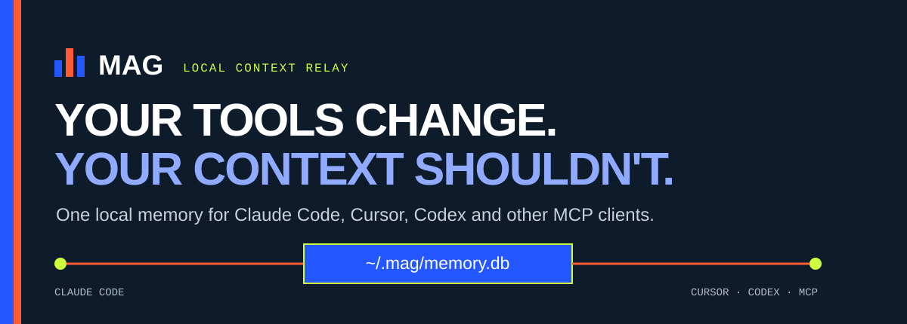
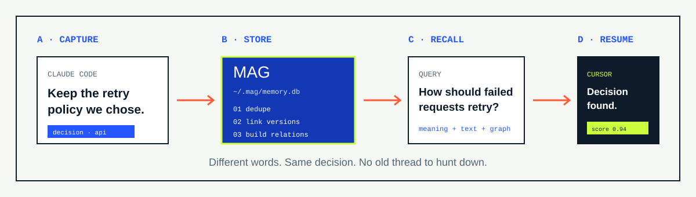

<picture>
  
</picture>

<p align="center">
  <a href="https://george-rd.github.io/mag/"><strong>See the landing page</strong></a>
  ·
  <a href="#quick-start"><strong>Install</strong></a>
  ·
  <a href="#how-mag-works"><strong>How it works</strong></a>
  ·
  <a href="#trade-offs"><strong>Trade-offs</strong></a>
  ·
  <a href="#roadmap"><strong>Roadmap</strong></a>
</p>

<p align="center">
  <a href="https://github.com/George-RD/mag/actions/workflows/ci.yml"></a>
  <a href="https://crates.io/crates/mag-memory"></a>
  <a href="https://www.npmjs.com/package/mag-memory"></a>
  <a href="LICENSE"></a>
  <a href="https://github.com/George-RD/mag"></a>
</p>

Built-in memory helps inside one tool. The harder problem starts when you switch tools, start fresh, or come back next week.

**MAG is a local memory layer for coding agents.** It stores useful choices, bug fixes, work rules and handoffs in one SQLite file, then returns the right pieces through MCP. Claude Code can also use native hooks to save and recall context.

One Rust binary. One SQLite memory store. No account.

Save a decision in Claude Code. Recall it later in Cursor or Codex.

## Quick start

```bash
curl -fsSL https://raw.githubusercontent.com/George-RD/mag/main/install.sh | sh
```

The installer gets the right binary, finds known tools and runs `mag setup`.

Save one real choice. Then search for it in new words:

```bash
mag ingest "Use exponential backoff with jitter for retries" \
  --tags decision,project:api-gateway

mag advanced-search "How should failed requests retry?" --explain
```

```text
Use exponential backoff with jitter for retries
score: 0.94
```

## Why MAG exists

Built-in tool memory is useful. Project docs are useful. Cloud memory services are useful. They solve different parts of the problem.

MAG is for people who want context to move between coding tools while the data stays on their machine.

| What matters | What MAG does |
|---|---|
| Switch between coding agents | The same memory store is available through MCP. |
| Keep private work local | Embeddings and recall run on your machine by default. |
| Find a decision without exact wording | Text, meaning and graph signals work together. |
| Keep control of the data | Memories live in one SQLite file that you can inspect and export. |
| Understand why something matched | `--explain` shows the signals behind each result. |
| Start without a new account | Install the binary and run `mag setup`. |

MAG does not replace project docs. Stable facts and contracts still belong in Git. MAG is for context that changes, spans projects, or should follow you between tools.

## How MAG works

<picture>
  
</picture>

### Capture

Store choices, root causes, work rules and session handoffs. MAG can be called from the CLI or through its MCP tools. The Claude Code plugin adds lifecycle hooks for automatic capture and context injection.

### Store

Before writing a memory, MAG checks for copies. It can mark old facts as replaced, build version chains, tag key names and link related memories.

### Recall

Advanced search runs meaning and full-text search at the same time. It joins the results, adds linked context and drops weak matches.

### Explain

Use `mag advanced-search "query" --explain` to see meaning match, text rank, overlap, graph links and the final score.

See [How MAG works](docs/architecture.md) for the full storage and recall pipelines.

## Tool support

`mag setup` knows these clients. MCP is the common layer; some tools get extra native guidance.

| Tool | Connection | Extra integration |
|---|---|---|
| Claude Code | MCP | Native plugin and lifecycle hooks |
| Claude Desktop | MCP | None |
| Cursor | MCP | Project rules |
| VS Code + Copilot | MCP | None |
| Windsurf | MCP | Project rules |
| Cline | MCP | None |
| Zed | MCP | None |
| Codex | MCP | `AGENTS.md` guidance |
| Gemini CLI | MCP | `AGENTS.md` guidance |
| OpenCode | MCP | Skill definitions |

Any other client that supports MCP can connect manually:

```json
{
  "mcpServers": {
    "mag": {
      "command": "mag",
      "args": ["serve"]
    }
  }
}
```

## Measured performance

MAG scored **90.1% word-overlap recall** on the full LoCoMo run: 1,986 questions across 10 long conversations.

AutoMem reports 90.5% in its own similar run. The scores are close. This is not proof that one system wins every workload. It shows that a fully local recall stack can be strong.

| LoCoMo category | MAG | AutoMem |
|---|---:|---:|
| Single-hop QA | 86.9% | 79.8% |
| Temporal reasoning | 85.0% | 85.1% |
| Multi-hop QA | 56.2% | 50.0% |
| Open-domain | 95.7% | 95.8% |
| Adversarial | 92.6% | 100.0% |
| **Overall** | **90.1%** | **90.5%** |

The same run averaged about 7 ms per query. These are recall results, not a score for every agent task, model or real workload.

Read the [benchmark method and environment](docs/benchmarks/methodology.md), then run it yourself:

```bash
./scripts/bench.sh
```

## Trade-offs

Local-first removes one class of trade-off and adds another.

| You gain | You accept |
|---|---|
| One memory store across tools | Team-wide cloud sync is not built in today. |
| No outside calls when you search | The local search model must be downloaded and loaded. |
| Data in a portable SQLite file | The database is plaintext. Use full-disk encryption. |
| No account or hosted dependency | You own backups, upgrades and local storage. |
| Search that works beyond exact words | Memory quality still depends on what you choose to store. |
| An open 0.1.x codebase | APIs and setup may still change. |

The local search model uses about 32 MB on disk and roughly 180 MB peak memory when loaded. Windows binaries are published, but Windows has had less testing than macOS and Linux.

### Good fit

MAG makes sense when you use several coding agents, work with private or client data, want local ownership, or need decisions to survive beyond one session.

### Wrong fit

Choose a different approach when you need managed team sync now, encrypted app storage, a browser-only service with no local setup, or automatic memory with no curation.

## Roadmap

The roadmap is a direction, not a release promise. There are no invented dates.

| Stage | Direction | Current issues |
|---|---|---|
| **Now** | Make capture and recall reliable across real sessions. Fix session IDs, recall after compaction, subagent capture and missing-model warnings. | [#247](https://github.com/George-RD/mag/issues/247), [#257](https://github.com/George-RD/mag/issues/257), [#258](https://github.com/George-RD/mag/issues/258), [#243](https://github.com/George-RD/mag/issues/243) |
| **Next** | Define connectors once, adapt them per tool, sync native memories and test automatic recall. | [#234](https://github.com/George-RD/mag/issues/234), [#236](https://github.com/George-RD/mag/issues/236), [#266](https://github.com/George-RD/mag/issues/266), [#341](https://github.com/George-RD/mag/issues/341) |
| **Explore** | Add local code search, codebase knowledge and portable skills without turning MAG into a cloud service. | [#210](https://github.com/George-RD/mag/issues/210), [#212](https://github.com/George-RD/mag/issues/212), [#213](https://github.com/George-RD/mag/issues/213) |

Track the working backlog in [GitHub Issues](https://github.com/George-RD/mag/issues).

## Install options

| Method | Command |
|---|---|
| Shell, macOS or Linux | `curl -fsSL https://raw.githubusercontent.com/George-RD/mag/main/install.sh \| sh` |
| Homebrew | `brew install George-RD/mag/mag` |
| npm | `npm install -g mag-memory` |
| uv | `uv tool install mag-memory` |
| pip | `pip install mag-memory` |
| Cargo | `cargo install mag-memory` |
| Source | `cargo install --git https://github.com/George-RD/mag.git` |

Prebuilt macOS, Linux and Windows binaries are on the [Releases page](https://github.com/George-RD/mag/releases).

Package-manager installs do not run setup automatically:

```bash
mag setup
```

## Data and security

By default, MAG stores data under `~/.mag/`:

```text
~/.mag/memory.db   # memories, embeddings and metadata
~/.mag/models/     # local ONNX models
```

No memory data leaves the machine in the default setup. The first model download needs network access. API models only run when you set them up.

The SQLite database is not encrypted. Do not store passwords, API keys or tokens. Use FileVault, LUKS or BitLocker when the threat model requires encryption at rest.

See [SECURITY.md](SECURITY.md) for the data-flow and disclosure policy.

## Documentation

- [Setup guide](docs/SETUP.md)
- [How MAG works](docs/architecture.md)
- [MCP tools](docs/mcp-tools.md)
- [What to store](docs/what-to-store.md)
- [Benchmarks](docs/benchmarks/)
- [Security](SECURITY.md)
- [Changelog](CHANGELOG.md)
- [Development conventions](AGENTS.md)

## Contributing

Bug reports, benchmark challenges and pull requests are welcome. Start with [open issues](https://github.com/George-RD/mag/issues) or read [AGENTS.md](AGENTS.md) before changing the codebase.

## Licence

MIT. See [LICENSE](LICENSE).
